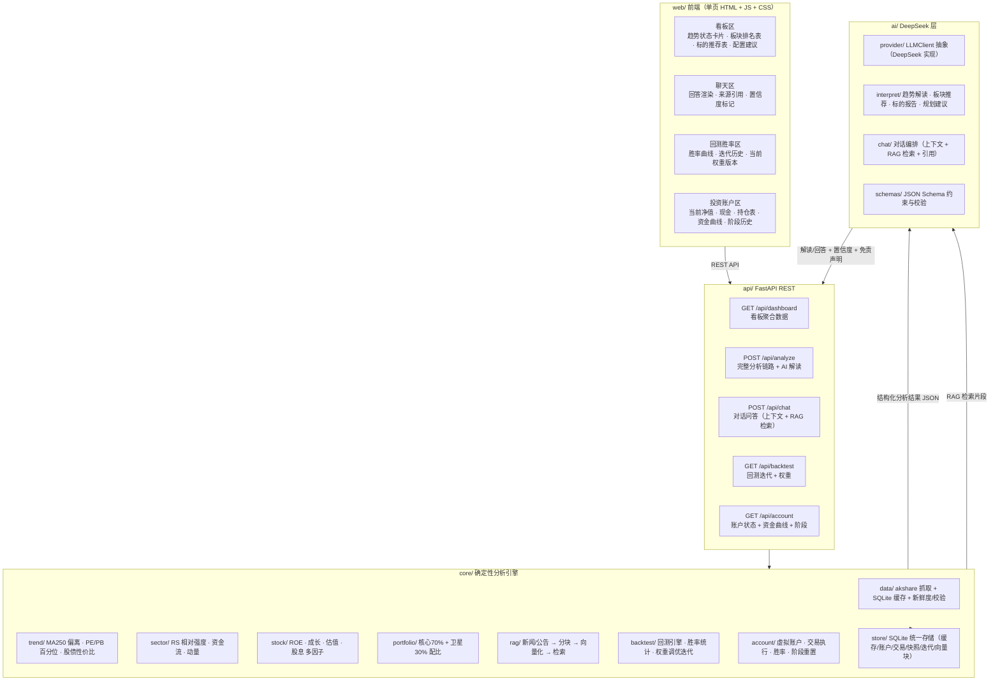
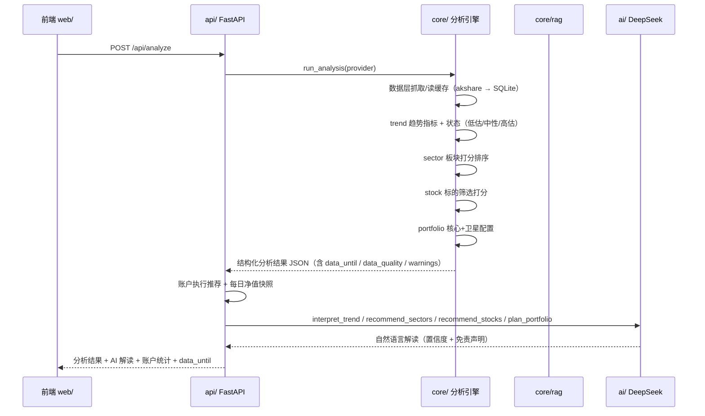
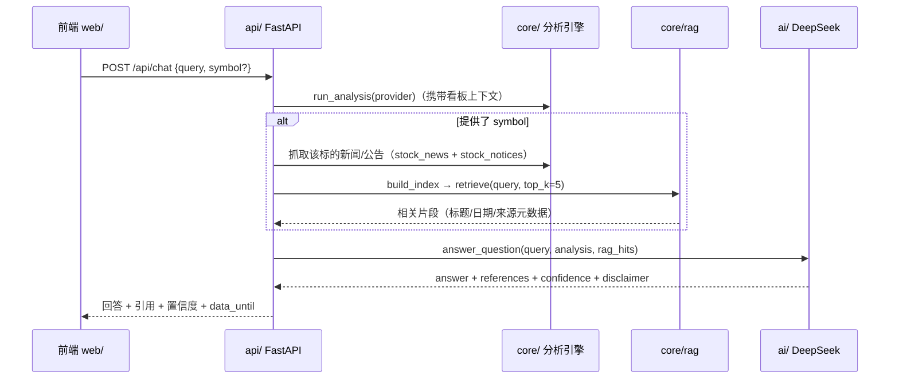

# 架构说明

本文件描述 AI 智能投资助手的系统架构，包括分层结构、数据流时序、错误降级策略与回测/账户指标口径。内容对应设计文档 `docs/superpowers/specs/2026-08-10-ai-investment-assistant-design.md` §5/§7/§8/§10。

## 1. 分层架构

系统分为 `web / api / core / ai` 四层。核心设计原则：**数据永不来自 LLM** —— 所有数字由确定性分析引擎（`core/`）从 akshare 真实数据计算，DeepSeek（`ai/`）只负责把结构化结果翻译为自然语言解读，是增强层而非依赖层。

### 各层职责

| 层 | 职责 | 关键文件 |
|---|---|---|
| `web/` | 单页前端：看板 + 聊天 + 回测胜率 + 投资账户 | `web/index.html` `web/app.js` `web/style.css` |
| `api/` | FastAPI REST 接口，编排分析、账户执行与 AI 解读；AI 失败时降级返回纯确定性结果 | `api/main.py` |
| `core/` | 确定性分析引擎 + 数据层 + 存储 | `core/data.py` `core/trend.py` `core/sector.py` `core/stock.py` `core/portfolio.py` `core/rag.py` `core/backtest.py` `core/tune.py` `core/account.py` `core/analyze.py` `core/store.py` |
| `ai/` | DeepSeek 层：Provider 抽象、JSON Schema 约束、解读/对话 | `ai/provider.py` `ai/deepseek.py` `ai/interpret.py` `ai/chat.py` `ai/schemas.py` |
| `config/` | 权重配置（网格搜索/调优的产物，随迭代版本更新） | `config/weights.json` |
| `tests/` | pytest 单元测试 + 端到端 | `tests/*.py` |

## 2. 数据流时序

### 2.1 完整分析 `POST /api/analyze`

### 2.2 对话问答 `POST /api/chat`

## 3. 错误降级（三层策略）

原则：**AI 是增强层，不是依赖层。** 任何一层失败都不应使整个请求失败。

| 故障 | 处理 |
|---|---|
| **数据层：akshare 网络/接口失败** | 重试 1 次 → 仍失败则读 SQLite 缓存旧数据（标注数据时点与"缓存命中"）→ 仍不可用则返回空数据并记录 `status=missing`，该项跳过 |
| **AI 层：DeepSeek 超时/调用失败** | `_safe()` 捕获异常并降级：跳过 AI 解读（`{}`），返回纯确定性分析结果，看板正常渲染 |
| **业务层：数据缺失/样本不足** | 跳过该条数据，其余正常返回；在 `warnings` 中显式标注（如"指数 MA250 样本不足"、"板块覆盖不足"、"选股候选不足"），AI 解读据此降低置信度 |

数据层每类数据记录 `fetched_at`（抓取时刻）、`data_until`（数据截止日）、`status`（`ok` / `cached` / `ok_retry` / `missing`）与 `ttl_seconds`，汇总为 `quality_report()` 随分析结果返回；所有分析输出与看板展示 `data_until`，前端标注"数据截至 <时间>"。

## 4. 回测与账户指标口径

### 4.1 回测指标（`core/backtest.py` + `core/tune.py`）

回测引擎以沪深300 为基准，按 `lookahead_days=63`（约一个季度）滑动重放：在每个决策时刻 `T` 仅使用 `T` 之前可得的历史板块数据计算打分，选出得分最高的 3 个板块组成等权组合，评估其在 `T+63` 日内的实际收益。

| 指标 | 口径 |
|---|---|
| **胜率 `win_rate`** | `组合区间收益 > 同期沪深300 区间收益` 的期数 ÷ 有效期数（`n_samples`）。胜场数记录为 `wins` |
| **平均超额收益 `excess_return`** | 各期 `(组合区间收益 − 基准区间收益)` 的算术平均 |
| **权重调优** | `tune.grid_search_weights` 对 `sector.rs / sector.flow / sector.momentum` 在 `{0.5, 0.7, 0.9}` 网格搜索，以训练窗胜率为目标；时间窗前 60% 调参、后 40% 验证，验证窗胜率提升才更新 `config/weights.json`（收敛阈值 `> 1e-9`），否则保持原权重 |
| **迭代记录** | 每次 `run_iteration` 写 `iter_history`：版本号、运行时间、权重、回测窗口、胜率、超额收益、数据截止日 |

防前视偏差：决策时刻只用当时可得数据；训练/验证时间窗分割；IC 监控因子有效性；权重更新设收敛阈值（变化过小则不更新）。

### 4.2 虚拟账户指标（`core/account.py`）

账户以虚拟资金（默认 100 万，`ACCOUNT_INITIAL_CAPITAL` 可配）执行自身推荐：每次 `analyze` 按推荐组合权重生成买卖指令，含简化交易成本（佣金费率 `FEE_RATE=0.0003`），持仓按最新行情更新市值，并记录每日净值快照。

| 指标 | 口径 |
|---|---|
| **当前净值 `nav`** | `现金 + Σ(持仓数量 × 最新价)`；最新价缺失时以成本价兜底 |
| **操作胜率 `win_rate`** | 已平仓交易中 `pnl > 0` 的笔数 ÷ 已平仓总笔数；未平仓不计入 |
| **阶段收益率 `return_pct`** | `(阶段末净值 − 阶段初资金) ÷ 阶段初资金`，同阶段展示沪深300 涨跌幅作基准（`benchmark_return`） |
| **阶段重置** | 默认每月为一个阶段；跨月时归档阶段历史（胜率、资金变化率、曲线、基准），清空持仓，资金重置为初始值 |

与回测的关系：`backtest` 为历史离线回测（评估打分权重、驱动调优），`account` 为当前在线模拟盘（执行推荐、跟踪实际绩效），两者指标口径统一（胜率、相对基准），互为补充。

## 5. 日志与可观测性

- **结构化日志**：`core/logging.py` 统一格式 `时间 | 级别 | 模块 | 消息`，`api.main` 对 AI 解读失败降级打 `warning`、对迭代失败打 `error`。
- **数据溯源**：数据层记录每个数据源的新鲜度/状态；分析结果带 `generated_at`、`data_until` 与 `data_quality` 报告。
- **前端标注**：看板与 AI 输出展示"数据截至 <时间>"，AI 解读在数据不足时降低置信度并说明。

## 6. 免责声明

本项目为数据分析与技术演示用途，不构成任何投资建议。回测胜率不代表未来收益，虚拟账户为模拟执行不含真实下单，投资有风险，入市需谨慎。
